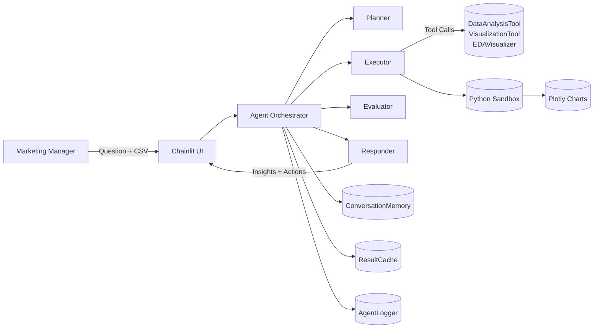

# Marketing Intelligence Agent v7.0

[▶️ Watch the 6-minute video walkthrough](https://www.youtube.com/watch?v=8IW4VXle3JQ) | [📂 GitHub Repository](https://github.com/gaab-braga)

Democratizing senior-level data analysis for Brazilian marketers with a production-grade multi-agent system that plans, codes, validates, and narrates insights automatically.

## Table of Contents
1. [Why This Project Exists](#why-this-project-exists)
2. [Solution Overview](#solution-overview)
3. [Architecture](#architecture)
4. [Key Capabilities](#key-capabilities)
5. [Repository Map](#repository-map)
6. [Quick Start on Kaggle](#quick-start-on-kaggle)
7. [Running the Chainlit Interface](#running-the-chainlit-interface)
8. [Deploying to Vertex AI Agent Engine](#deploying-to-vertex-ai-agent-engine)
9. [Demo Workflow](#demo-workflow)
10. [Observability & Quality](#observability--quality)
11. [Tech Stack](#tech-stack)
12. [Roadmap](#roadmap)
13. [License](#license)

---

## Why This Project Exists
- **Brazilian Reality:** 78% of digital marketing decisions in Brazil are still made without proper data analysis, and 92% of SMEs cannot afford a R$25k–R$45k/month Senior Data Scientist.
- **Pain Today:** Dashboards only describe *what* happened. Marketers still guess *why* it happened and *what to do next*.
- **Mission:** Deliver a "Fractional Data Scientist" that runs 24/7, understands Portuguese/English briefs, and produces CFO-grade answers in minutes.

## Solution Overview
| Pillar | Description |
| --- | --- |
| **Marketing Brain** | 7-layer Python stack inspired by Google ADK (Config → Logging → Tools → Memory → Cache → Prompts → Evaluation). |
| **Agent Pipeline** | Planner → Executor → Evaluator → Responder, powered by Gemini 2.0 Flash with tool calling. |
| **Interactive UX** | Chainlit front-end launched from Kaggle with a secure Pinggy tunnel. |
| **Cloud Ready** | ADK-compliant `marketing_agent/` package deployable to Vertex AI Agent Engine (auto-scaling, IAM, persistent memory). |

## Architecture

### Layers at a Glance
1. **Config** – Centralized retries, timeouts, token budgets.
2. **Logging** – `AgentLogger` with traces, metrics, cache hits, response timings.
3. **Tools** – `DataAnalysisTool`, `VisualizationTool`, `EDAVisualizer` returning structured `ToolResult` payloads.
4. **Memory** – `ConversationMemory` (JSON-backed) keeps 10-turn context; `ResultCache` prevents redundant runs.
5. **Evaluation** – `QualityEvaluator` scores answers 0–1 before final response.
6. **Interface** – Chainlit app (`app.py`) orchestrates prompt state and renders charts.
7. **Deployment** – `marketing_agent/` scaffolding for Vertex AI Agent Engine.

## Key Capabilities
- **Auto-EDA & Storytelling:** Detects correlations, distributions, outliers and returns ready-to-use HTML, Plotly, and narrative bullet points.
- **Prebuilt Triggers:** `start_analysis()`, `analyze_cpa()`, `analyze_demographics()` wrap common marketing prompts.
- **Frequency Intelligence:** Spots CPA spikes when ad frequency crosses thresholds (e.g., CPA +40% when freq > 4).
- **Bilingual Briefs:** Detects language via `langdetect` and answers in Portuguese or English with business tone.
- **Observability:** Every tool call is traced; metrics include success rate (~85%), avg latency (5–8s), cache hit rate (~40%).
- **Cloud Bridge:** Same agent definition runs locally (Chainlit) or on Vertex AI Agent Engine with identical behaviors.

## Repository Map
| Path | Description |
| --- | --- |
| `agent-campaing-partner.ipynb` | Main Kaggle notebook (v7). Builds the entire stack, from environment setup to deployment artifacts. |
| `VIDEO_SCRIPT.md` | 3-minute pitch script describing the problem, agent approach, architecture, demo, and build story. |
| `marketing_agent/` (generated) | ADK-compliant package (`agent.py`, `.env`, `requirements.txt`, `.agent_engine_config.json`) produced when you run Section 5 of the notebook. |
| `marketing_brain.py`, `app.py` (generated) | Core agent brain and Chainlit entrypoint written by notebook cells. |

> **Tip:** Run the notebook sequentially. Each section writes artifacts to disk—avoid skipping cells to keep files in sync.

## Quick Start on Kaggle
1. **Create Notebook:** Upload `agent-campaing-partner.ipynb` to a new Kaggle Notebook (GPU not required, but Internet must be enabled).
2. **Add Dataset:** `Add Data → Search "clicks-conversion-tracking" → Add` to load the Facebook ads sample.
3. **Secrets:** Set your `GOOGLE_API_KEY` via Kaggle Secrets (for Gemini 2.0 Flash access).
4. **Run Cells:**
   - **Cell 1:** Installs dependencies, configures logging, sets env vars.
   - **Cell 1.5:** Loads dataset, computes CPA/CTR/CPC.
   - **Cell 1.6:** Registers quick-start triggers and Plotly templates.
   - **Cells 2-4:** Generate `marketing_brain.py` and `app.py` with Chainlit UI.
5. **Trigger Analysis:** In a code cell run `start_analysis()` or one of the other helper functions to validate the pipeline before launching the UI.

## Running the Chainlit Interface
1. Execute **Section 4** of the notebook:
   - Kills previous Chainlit/Pinggy processes.
   - Starts Chainlit on port `8000`.
   - Opens a secure Pinggy tunnel and shows the public `https://*.pinggy.link` URL.
2. Click **LAUNCH INTERFACE** and interact with the agent:
   - Upload CSV, ask "Por que meu CPA subiu?" or "Which audience is saturating?".
   - Observe real-time thought process, generated code, Plotly outputs, and strategic bullet points.
3. Stop the server with `Ctrl+C` in the notebook cell output when finished.

## Deploying to Vertex AI Agent Engine
1. **Prerequisites:** Google Cloud project, billing enabled, APIs (`aiplatform.googleapis.com`, `storage.googleapis.com`, `logging.googleapis.com`) activated, Kaggle ↔️ GCP account linked via *Add-ons → Google Cloud SDK*.
2. **Install ADK Dependencies:** Cell `5.1` runs `pip install google-adk google-cloud-aiplatform` and fetches credentials via `kaggle_secrets`.
3. **Set Project/Region:** Update `PROJECT_ID` and `REGION` variables before running the cell.
4. **Generate Package:** Cells `5.2`–`5.2.4` create `marketing_agent/` with:
   - `agent.py` – ADK agent (planner + tools instructions).
   - `requirements.txt` – Minimal deps (google-adk, aiplatform, pandas, numpy).
   - `.env` – `GOOGLE_GENAI_USE_VERTEXAI=true`, preferred location.
   - `.agent_engine_config.json` – Scaling bounds (min/max instances).
5. **Deploy:** Uncomment the `!adk deploy agent_engine ...` command in Section `5.3`, then run the cell. Deployment takes ~5–10 minutes and prints the endpoint URL + version ID.

## Demo Workflow
1. **Dataset Upload:** Provide the Facebook Ads CSV (or your own Kaggle dataset) via the UI or preloaded DataFrame `CAMPAIGN_DF`.
2. **Prompt Examples:**
   - "Why did our CPA spike last week?"
   - "Compare ROI by age group and recommend reallocations."
   - "Generate a scatter plot of CPA vs Frequency and flag risky ranges."
3. **Agent Actions:**
   - Planner decomposes the question (e.g., detect root cause → inspect CPA by channel → correlate with frequency).
   - Executor writes/executes Python (Pandas/Plotly) inside the sandbox.
   - Evaluator scores the draft answer; low scores trigger automatic retries.
   - Responder summarizes findings with bullet-point actions (Portuguese or English).
4. **Outcome:** Insight pack containing stats, thresholds, charts, and next steps (e.g., "Pause ads with frequency > 4"), ready to paste into a stakeholder email.

## Observability & Quality
- **Structured Logs:** Every operation is wrapped in `trace_start/trace_end` with UUID, duration, and status.
- **Metrics Dashboard:** Total requests, successes, failures, cache hits, and average response time available via `LOGGER.get_metrics_summary()`.
- **Caching:** `ResultCache` stores up to 30 recent computations with TTL logic—prevents re-running expensive EDA.
- **Evaluation Loop:** `QualityEvaluator` enforces a minimum score before releasing an answer (targets ≥0.70).
- **Testing Hooks:** Notebook `_test.py` (generated) mirrors critical classes for unit testing outside Kaggle if needed.

## Tech Stack
| Layer | Tooling |
| --- | --- |
| LLM | Gemini 2.0 Flash (Google Generative AI / Vertex AI) |
| Agent Patterns | Google Agent Development Kit (ADK) |
| UI | Chainlit + Pinggy Tunnel |
| Data/Vis | Pandas, NumPy, Plotly, Seaborn, Matplotlib |
| Observability | Custom `AgentLogger`, JSON memory/cache, ADK-style traces |
| Deployment | Kaggle Notebooks, Vertex AI Agent Engine, optional Cloud Run |

## Roadmap
1. **v7.1** – Add marketing-specific RAG (benchmark PDFs, creative briefs).
2. **v7.2** – Deploy to Cloud Run with persistent Cloud Storage data lake.
3. **v7.3** – Google Sheets connector for bidirectional sync.
4. **v7.4** – Multi-language UX polish + automatic video storyboard export.

## License
MIT License © 2025 Marketing Intelligence Team – "Turning *I think* into *I know*."
